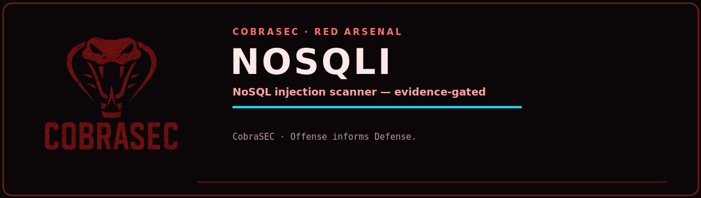

<p align="center">
  
</p>

# nosqli

Dependency-free, evidence-gated NoSQL injection scanner for systems you are authorized to test.

```sh
./nosqli https://target/login --login --username-field username --password-field password
./nosqli https://target/login --login --json-login --json
./nosqli https://target/search -p 'user=FUZZ' -p 'active=true'
./nosqli https://target/api/search --data '{"user":"FUZZ"}'
```

Form probes use bracket syntax (`user[$ne]=x`, `user[$gt]=`, `user[$regex]=.*`). JSON
markers are replaced with operator objects (`{"$ne":null}`, `{"$gt":""}`,
`{"$regex":".*"}`). Login mode first sends random junk credentials, then requires a
redirect, new session cookie, or explicit failure-to-success content transition. Boolean
oracle results require two stable samples on each side. A plain HTTP 200 is never evidence.

Exit status is 0 when clean, 1 with findings, and 2 when requests failed without findings.

## Local lab

In separate terminals:

```sh
python3 vuln_app.py --port 18080
python3 safe_app.py --port 18081
./nosqli http://127.0.0.1:18080/login --login
./nosqli http://127.0.0.1:18081/login --login
```

Both applications also accept `--json-login` scans. The vulnerable lab intentionally
implements Mongo-like operator matching and leaks an error for malformed `$where`; the
safe lab rejects structured operator input.
